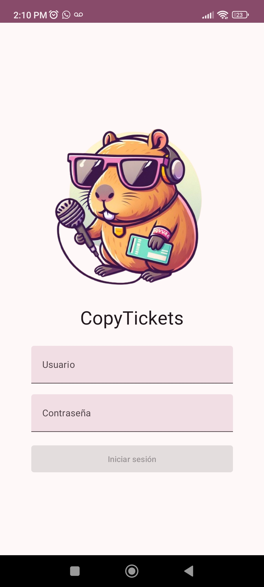
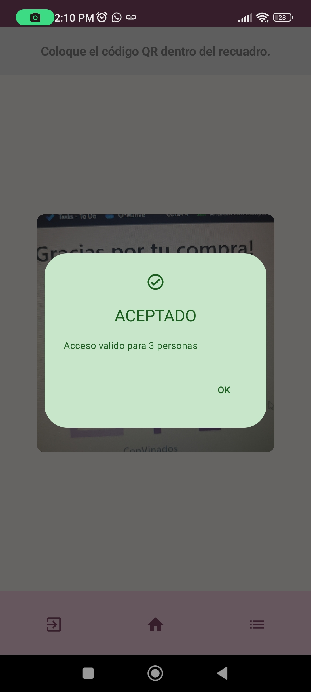

# CopyTickets App 🎫📱

App móvil para la lectura de códigos QR generados por CopyTickets web.

## Funciones y características

* Android con Kotlin y Jetpack Compose
* Autenticación (Requiere API de CopyTickets web).
* Almacenamiento de usuario actual en DataStore.
* Escaneado de códigos QR (Requiere API de CopyTickets web).
* Registro de escaneos en base de datos local SQLite.

## Acerca de la API

Esta app fue realizada en conjunto con el
proyecto [CopyTickets web](https://github.com/JSamuelAP/copytickets). Dicho proyecto contiene una
pequeña API para la autenticación, manejo de JWT y escaneo de boletos.

Si no se cuenta con la API y la base de datos, en la rama ``preview`` se encuentra una versión que
simula el comportamiento de la App.
